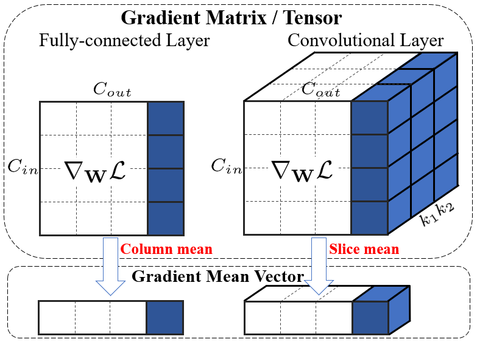
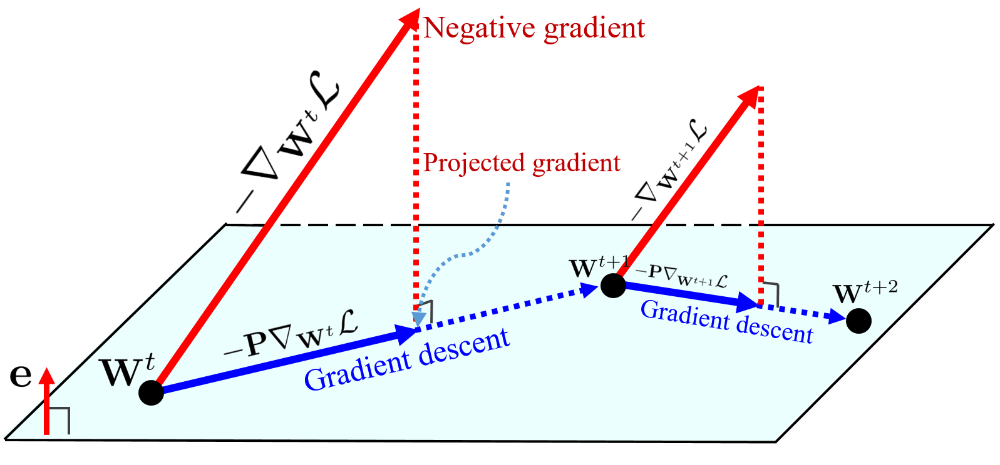

# gradient-centralization-gluon

Gradient Centralization implementation (unofficial) in mxnet gluon.
# Gradient Centralization

## [Gradient Centralization: A New Optimization Technique for Deep Neural Networks](https://arxiv.org/abs/2004.01461)

***

## Introduction

* Gradient Centralization (GC) is a simple and effective optimization technique for Deep Neural Networks (DNNs), which operates directly on gradients by centralizing the gradient vectors to have zero mean. It can both speedup training process and improve the final generalization performance of DNNs. GC is very simple to implement and can be easily embedded into existing gradient based DNN optimizers with only few lines of code. It can also be directly used to finetune the pre-trained DNNs.

* GC can be viewed as a projected gradient descent method with a constrained loss function.  The Lipschitzness of the constrained loss function and its gradient is better so that the training process becomes more efficient and stable.   Our experiments on various applications, including `general image classification`, `fine-grained image classification`, `detection and segmentation` and `Person ReID` demonstrate that GC can consistently improve the performance of DNN learning. 

## Reference
[Original Repo](https://github.com/Yonghongwei/Gradient-Centralization)
